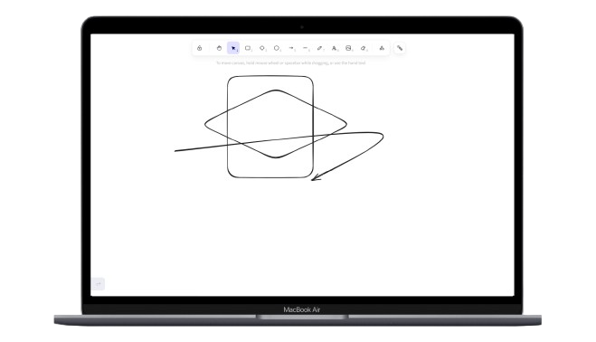

# Collab-Draw


### Introduction

This is a minimalist starter project for locally deploying Excalidraw based on Next.js, YJS, and Socket.IO. Through YJS, it enables real-time collaboration and data storage. The system uses MinIO client for resource file storage and MongoDB for data persistence.


### Leave a star 🌟



---

### Project Structure

- **Server-side YJS configuration**: Located in `src/server/collab.ts`
- **Client-side YJS configuration**: Located in `src/excalidraw/collab.ts`
- **Editor configuration**: Located in `src/excalidraw/index.tsx`
- **Resource management**: Located in `src/excalidraw/store.ts`

### Routing

- **Default route (`/`)**: Uses local IndexedDB with WebRTC for saving and collaboration between pages
- **ID-based route (`/:id`)**: Uses WebSocket for collaboration between clients with the same ID
  - To also save to local IndexedDB, add `?indexeddb=true` to the URL query parameters

### Installation

```bash
# Due to issues with y-excalidraw, you need to use the --force flag
npm install --force
# or
yarn install --force
```

### Local Development

```bash
npm run dev
# or
yarn dev
```

Open [http://localhost:3000](http://localhost:3000) with your browser to see the result.

### Production Deployment

#### Build and Run

```bash
# Build the project
npm run build
# or
yarn build

# Start the server
cd dist
node server.js
```